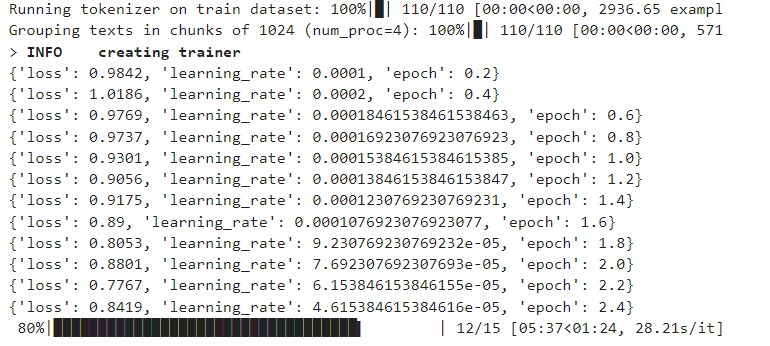
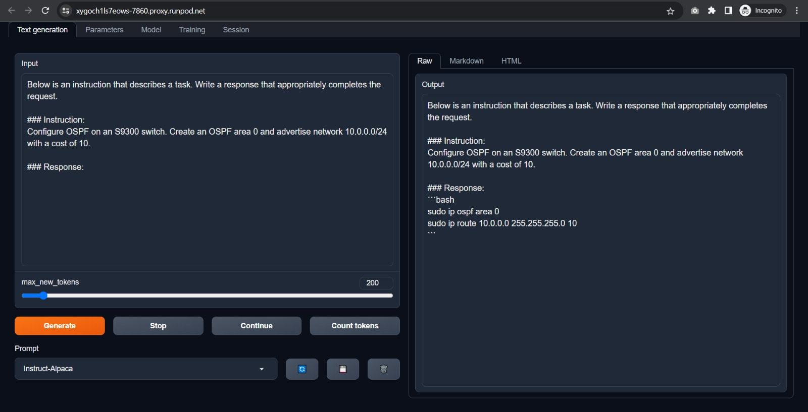
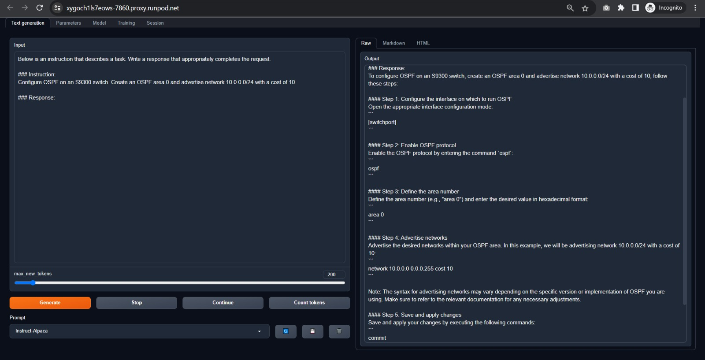

## LLaMA-2-Datacom: Model Trained With Datacom Knowledge

🤗 <a href="https://huggingface.co/engkufizz" target="_blank">HF Repo</a> • 🐦 <a href="https://twitter.com/engkufizz" target="_blank">Twitter</a>   

## Table of Contents
- [Project Description](#project-description)
- [Results and Examples](#results-and-examples)
- [Limitations and Future Improvements](#limitations-and-future-improvements)
- [License](#license)
- [Acknowledgements](#acknowledgements)

# Project Description
A proof of concept involves finetuning Meta's llama-7b using a custom Datacom dataset that I generated with the self-instruction techniques. I believe that locally hosted models have the potential to serve as interesting alternatives to OpenAI API calls and vector databases for constructing assistants aimed at assisting with specific tasks and providing information

## Training data
| Loss & Learning Rate |
| --------- |
|  |

# Results and Examples
I fully expected complete gibberish from the first attempt, but I am pleasantly surprised by the quality of the results:
| Base Llama2 | llama-2-datacom |
| --- | --- |
|  |  |

Clearly, base Llama 7b has no idea what's going on and can't provide information about datacom configurations. However, when augmented with llama-2-datacom, it has no issues generating high quality responses that are clearly derived from the new datacom dataset.

# Limitations and Future Improvements
Being a language model, llama-2-datacom is prone to hallucinations and can make up details or give incorrect information. That being said, this is still very much in the early stages, and the output could be improved and refined in a number of ways. The obvious thing being that it's not really advisable to use the default chat assistant from the webui for prompting. Lastly, there is certainly room for improvement in enhancing the dataset,  those who are interested can contribute by submitting pull requests.

# License
This project is licensed under the MIT License.

# Acknowledgements
Wouldn't have thought of this without [Stanford's Alpaca research](https://github.com/tatsu-lab/stanford_alpaca). A special thank you goes to them for contributing the script to generate the dataset and the code for the training.
